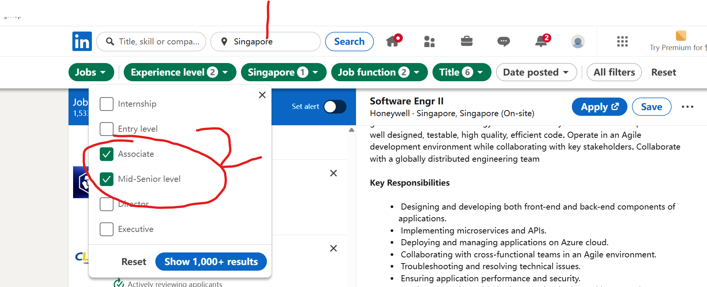

It's first two days to search jobs and priority to work in Sgp.I need job visa and want to work as software engineer to develop.My results are as follows in [linkedin](resources/bookmarks_2025_8_20_jobs.html)
you can open it in you browser.Jobs like this
* I registered linked in and a lot of apps.I find jobs in Sgp is much more than the UAE in linkedin and GulfTalent.Apps are as follows:

* I tried to search jobs in linked and my advice are as follows:
  1. **filters are important** jobs filter like this in [linkedin](https://www.linkedin.com/jobs/search/?currentJobId=4274786601&f_E=3%2C4&f_F=it%2Ceng&f_PP=103804675&f_T=9%2C39%2C25194%2C30006%2C6483%2C10738&geoId=102454443&origin=JOB_SEARCH_PAGE_SEARCH_BUTTON&refresh=true&sortBy=R&spellCorrectionEnabled=true&start=250):
     1. filter 1 location:Sgp is important and choose the experience for working, associate means you are not leader and new graduated,just mid class experience.  
     2. filter 2 job function and title: it means you are it/computer science worker and not the company industry is not so important,get first offer goes first.
  2. **alumni is so important！！！
     1. I searched all jobs and got more than 1500+ results.It's hard to get my target jobs with offer and visa.Then I found linkedin has tags like **alumni** meaning your college mates or company colleagues,companies where they're  working probably supply visa offers.I fill my university XJTU and worked companies bytedance,then i can get result much more quickly.
  3. Search companies first:jobs for applicant of one company are similar,so you need to aim to companies supplies sites both in US and Sgp.
  

